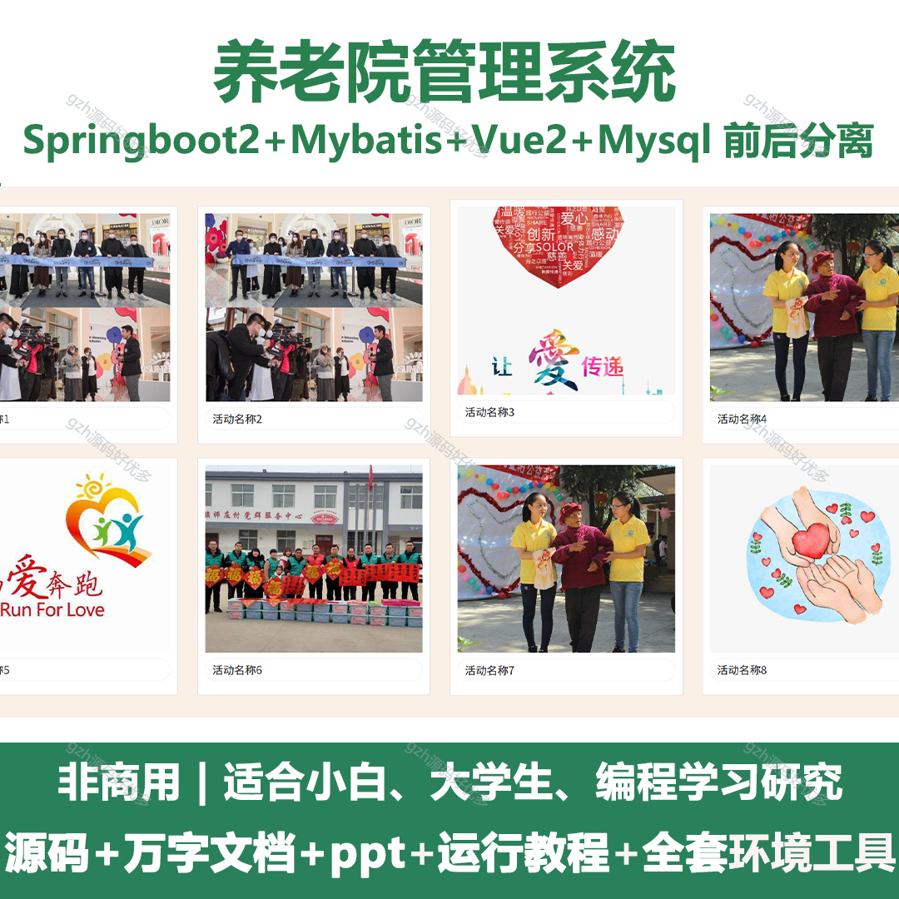
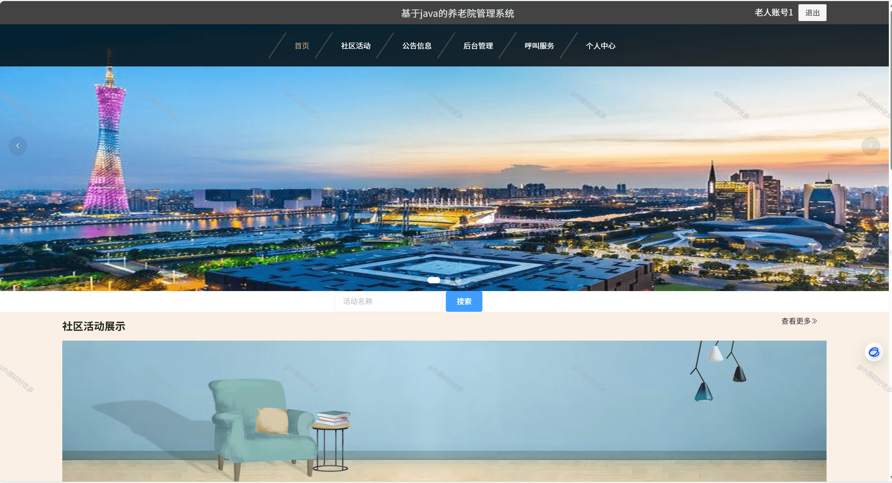
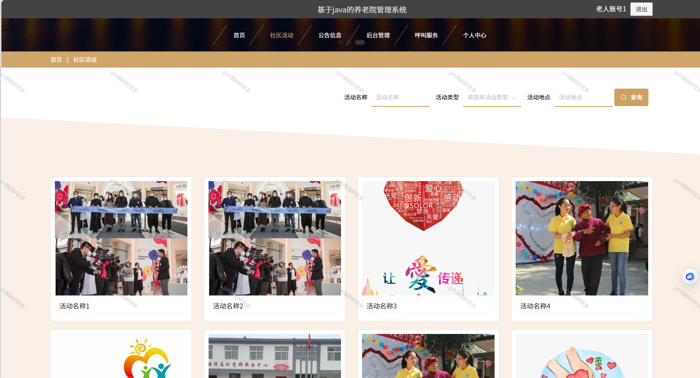
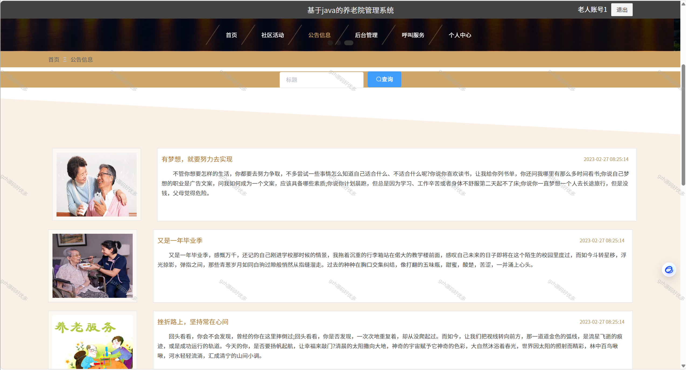
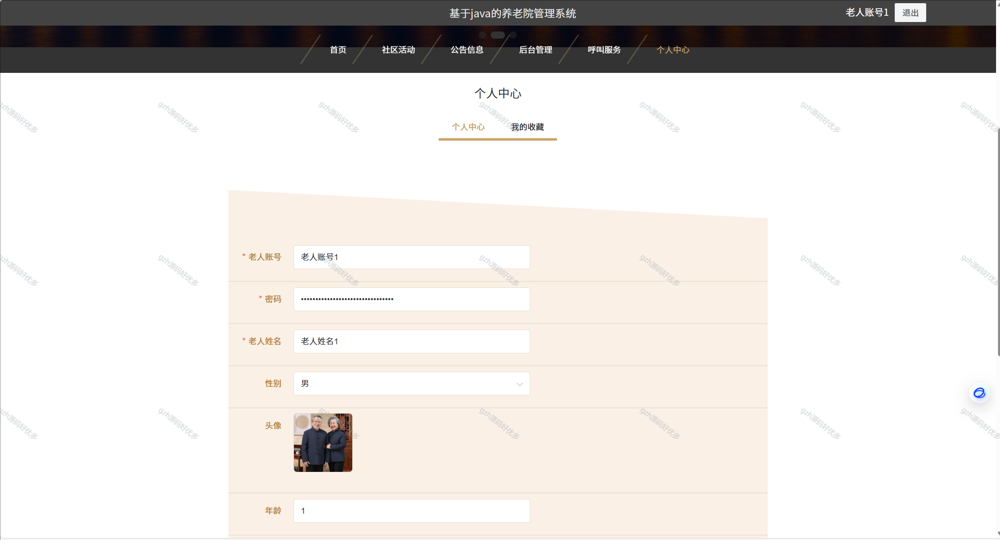
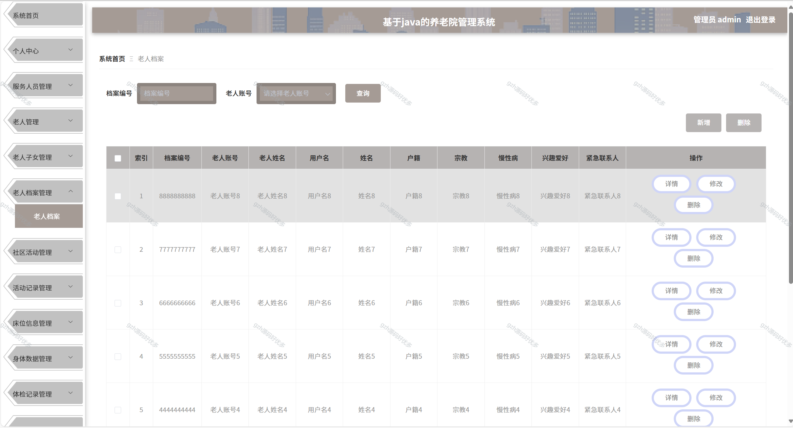
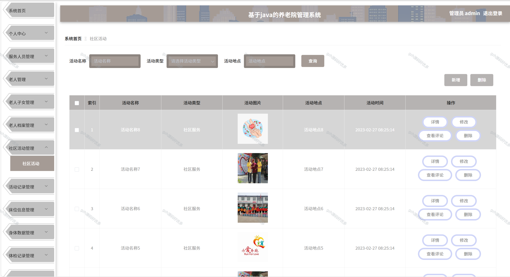
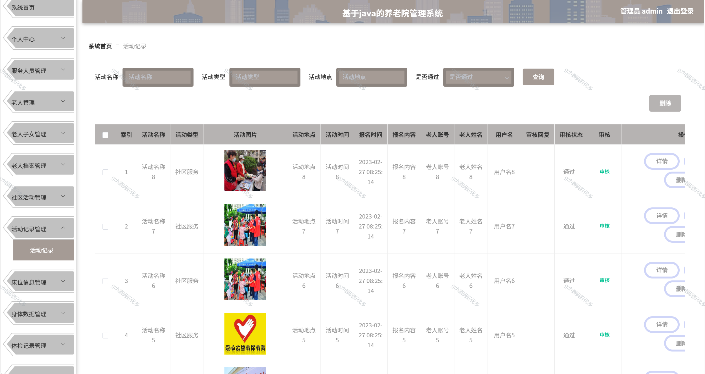
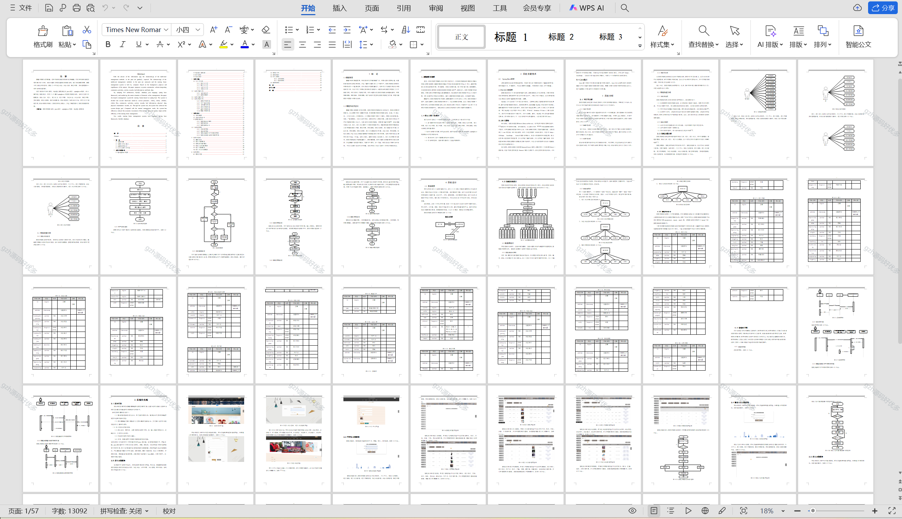

# springbootA287
springbootA287养老院管理系统
 
## 查看主页获取源码

### 一、关键词
养老机构管理系统，敬老院管理系统，养老服务机构管理系统

### 二、作品包含
源码+数据库+设计文档万字+PPT+全套环境和工具资源+本地部署教程

### 三、项目技术
前端技术：Html、Css、Js、Vue2.0、Element-ui 
后端技术：Java、SpringBoot2.0、MyBatis

### 四、运行环境（以下版本亲测，其他版本兼容性请自行测试）
开发工具：IDEA/eclipse  + VSCODE

数据库：MySQL5.7（最低要5.7版本）

数据库管理工具：Navicat10以上版本

环境配置软件： JDK1.8 + Maven3.6.3

前端Nodejs：14

浏览器：谷歌浏览器

### 五、项目介绍
项目编号：springbootA287

随着信息时代的来临，过去的传统管理方式缺点逐渐暴露，对过去的传统管理方式的缺点进行分析，采取计算机方式构建养老院管理系统。本文通过课题背景、课题目的及意义相关技术，提出了一种社区活动、活动记录、床位信息、身体数据等于一体的系统构建方案。
系统分为多个功能模块：服务人员、老人、老人子女、老人档案、社区活动、活动记录、床位信息、身体数据、体检记录等。通过系统测试，本系统实现了系统设计目标，相对于人工管理方式，本系统有效的减少了养老院的经济投入，并且大幅度提升了养老院管理的效率。

### 六、运行截图

